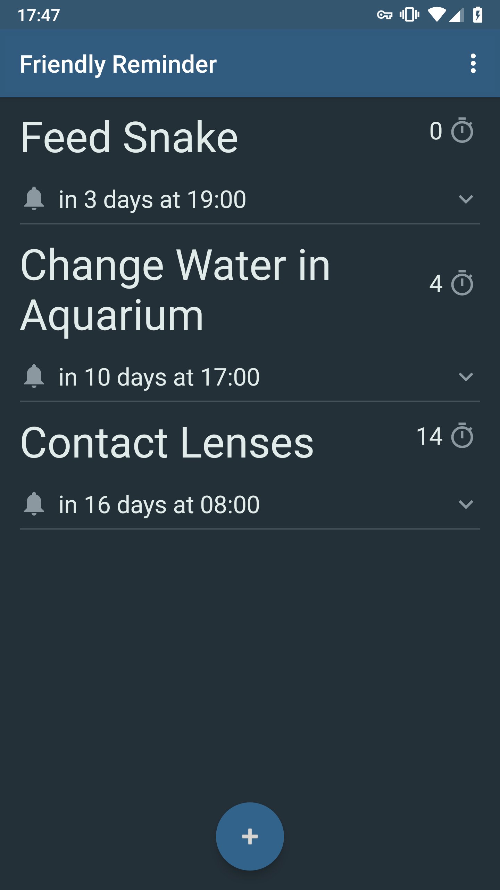
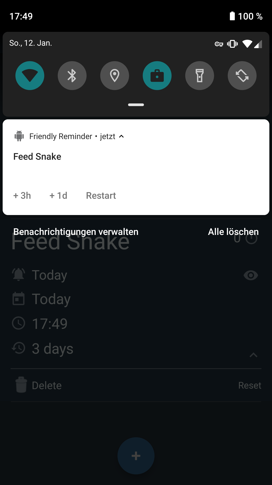
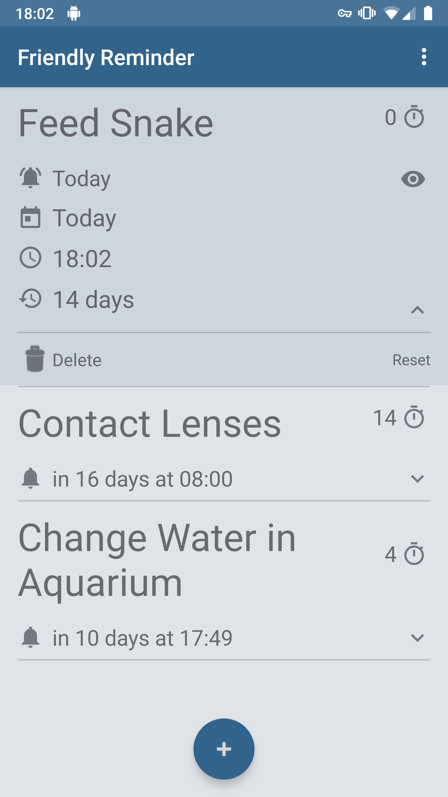
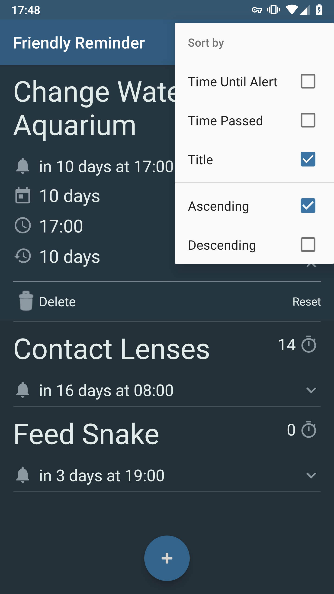

# Friendly Reminder

With this app you can set up reminders for actions that need to be repeated in a given interval 
(e.g. feed your snake or replace your contact lenses). The advantage to using a calendar is 
that you don't have to think about the actual date when the action needs to be performed. The reminder can simply be restarted 
with the given interval or repeated later in case you don't have time to perform the action right now. 
Reminders will be highlighted after sending a notification until they are marked 'seen' or restarted.

Screenshots:

